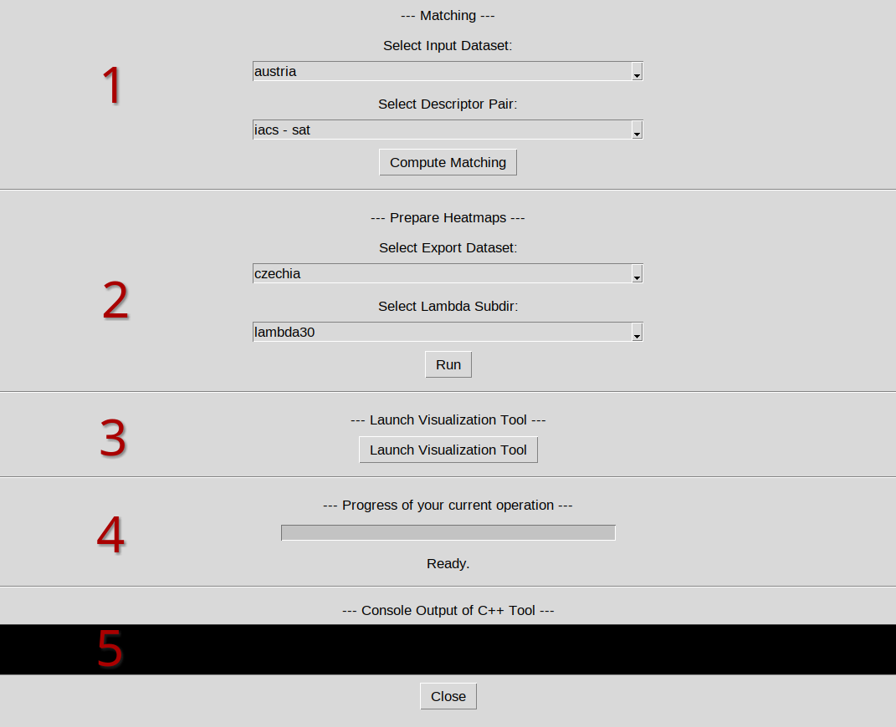

# AgriMatch  
### `Land-Use Polygon Matching`
This repository provides a Python and C++ pipeline for matching and visualizing large-scale (land-use) polygon datasets.

The workflow is designed to enable comprehensive comparisons of agricultural field polygons across datasets that differ in granularity, quality, and temporal reference. By establishing spatial correspondences between datasets, the pipeline supports:

- Spatial and semantic quality validation
- Consistency analysis
- Data fusion and enrichment
- Detection and analysis of temporal changes

In addition, the repository includes a web-based visualization tool for interactive exploration of comparison results. Implemented as an intuitive map viewer, it allows users to examine multiple comparison metrics directly within their geographic context. The visualizations are specifically designed to clearly communicate both spatial and semantic alignment between datasets, making large-scale differences and agreements immediately interpretable.

## Data Preparation
Your input data should be placed into `input/dataset_name`. It must be in the `.gpkg`file format. The files should be named in the form `dataset_name_descriptor1.gpkg` and `dataset_name_descriptor2.gpkg`. The descriptors should be short markers specifying the different dataset sources, e.g., `iacs` and `sat`.

## C++-Setup
The C++ project requires the libraries `CGAL` (6.0.1), `boost`(1.83.0), `Gurobi`(12.0) and `GDAL`(3.8.4).

With all libraries installed, the project can be built by navigating to the project folder and executing:
```bash 
mkdir build && cd ./build
cmake ..
make
``` 

The following section explains how to execute the code a a standalone application. This is optional. 
We recommend the execution via the python GUI we provide in the directory `gui/`. For that, skip to the section GUI-Tool.

## Usage

After building the project, it can be executed by:
```bash 
./TCPolygonMatching 
``` 

It supports multiple Command Line Options.

### Necessary Command Line Options
1. `-d`: specify the `dataset_name`. The code expects it to be located within the directory `input/dataset_name` as two geopackages `dataset_name_iacs.gpkg`and `dataset_name_sat.gpkg`.
2. Specify the value of $\lambda \in [0,1]$ used in the objective $f(\mu) = \mathrm{IoU}(\mu) - \lambda$
    - `-l`: allows to specify one value for lambda
    - `-lr`: allows to specify a range of multiple lambda values `start stepsize end`

### Optional Command Line Options
1. `-dd1` and `-dd2`: specify the data name extensions for the two datasets to be matched, default is 'iacs' and 'sat'.
2. `-s`: deactivates exploit of properties of optimal solutions in preprocessing.
2. `-t`: specify the number of threads used by the code, default is 1.
3. `-r`: specify the mode that is used to build the hierachical groupings (informed,kruskal), default is informed.
4. `-m`: specify the solution mode (opt,3approx), default is 3approx.
5. `-e`: specify a name for the log-file generated on output, default is log.

### Output
After matching the input datasets, the program will place multiple files into the directory `output/dataset_name`:
- `log.csv`: Contains general information about the run, e.g., running time and settings.
- within `lambda[your_chosen_lambda*100]/`:
  - `dataset_name_iacs_matched_MtoN.gpkg`: The original IACS dataset, extended with attributes `match` (match id) and `weight` (match quality) per polygon
  - `dataset_name_sat_matched_MtoN.gpkg`: The same for the original SAT dataset.
  - `dataset_name_data_MtoN.csv`:  The match id and match quality in a table per single polygon of both input datasets.
  - `dataset_name_data_MtoN_per_match.csv` : The match id, included polygons and quality per match in the matching. Contains the same information as the other `.csv` file, but is more efficient to read if one wants to analyze the matches instead of the polygons.

## GUI-Tool

The entire code execution and data preparation for the visualization can be performed by the GUI tool we provide within the directory `gui/`.
To use the tool, navigate to the directory and install the necessary dependencies:

```bash 
cd gui 
python3 -m venv .venv
source .venv/bin/activate
python3 -m pip install -r requirements.txt
```

Now, the GUI can be launched by calling: 
```bash 
cd gui 
python3 main.py
```

The GUI provides all necessary functionalities to perform the full workflow from matching over the preparation of the heatmap data to its visualization in a browser window.

<p align="center">

</p>

1. Matching
    - Allows for a selection of the input dataset and the different sources to be matched.
    - Valid input datasets are automatically recognized if the directory `dataset_name` exists within the directory `input` and includes two geopackages of the form `dataset_name_descr1.gpkg` and `dataset_name_descr2.gpkg`.
    - Automatically builds and executes the C++ matching code. Make sure that all necessary libraries listed above are installed on your system.
2. Heatmap Computation
    - After computing the matching, the results are automatically saved in the directory `export`. The exported datasets can be selected in the dropdown and the heatmaps can be created via the button below.
    - **Note**: To compute the heatmaps, the code expects the respective boundary of the region within the directory `region_boundaries` as a geopackage file `dataset_name.gkpg`.
    - If for a dataset, the heatmap should also contain a comparison of the thematic agreement of the matched datasets, you can enter the specific columns and values to be compared into the provided `config.yaml` in the `gui`directory.
3. Visualization Tool
    - Can be launched via the button, automatically opens a browser window with the visualization tool.
    - We recommend to press the button again after closing the visualization tool to make sure the local server is terminated correctly.
4. Progress Bar
    - Allows for progress tracking of the currently active operation.
5. Console Log
    - Displays the console log generated by the C++ code. This is for traceability reasons, as it allows for recognizing possible errors in the C++ build procedure and tracing the execution progress.
  
## Funding

<p align="left">
  
</p>

This work was supported by the German Research Foundation (DFG) under grant numbers 459420781 and 501899475. 
It was partially conducted within the framework of the NFDI consortium FAIRagro (https://www.fairagro.net).
